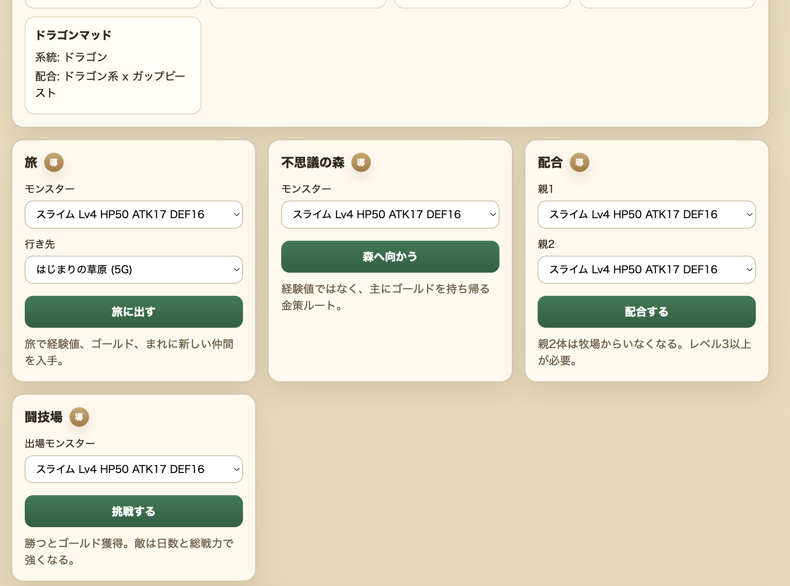
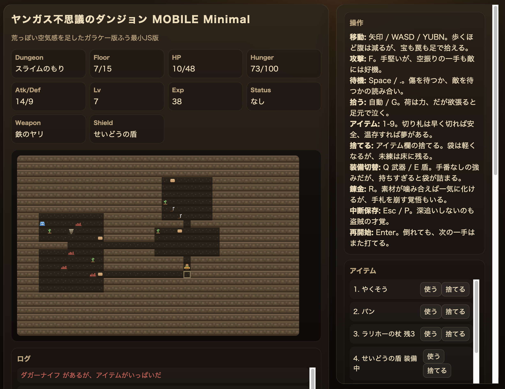

## 背景
* 小学生のころ、親のガラケーを借りてドラクエをやっていた
  * 自分の携帯ではなかった
  * 後から通信料で 2,3 万円くらい請求されてめちゃくちゃ怒られた苦い思い出がある
* 今考えると当たり前なんだけど、当時は「ゲームをしている」感覚であって「通信している」感覚はかなり薄かった
* それくらい、ガラケーのドラクエには自分の中で妙な実感が残っている

作ってみると、仕様を再現することと、当時楽しかった体験を再現することはかなり違うと分かった。

<!--more-->

## きっかけ
* [攻略サイトが“仕様書”に？　ソースコード無きRPG『ラミィの大冒険』を蘇らせるまで](https://levtech.jp/media/detail_827/) という記事を読んだ
  * ソースコードや社内資料が残っていないゲームを、当時の攻略サイトやプレイ検証から復活させる話
  * 「攻略サイトが仕様書になる」という発想が面白かった
* 自分の場合は実機も元データも持っていないので、本当の復刻ではない
* ただ、公開情報を集めて仕様にして、ブラウザで遊べるおもちゃを作ることはできるのでは？と思った

対象にしたのは以下の 2 つ。

* ドラゴンクエストモンスターズ i / MOBILE
* ドラゴンクエスト不思議のダンジョン MOBILE

## ガラケーゲームの前提
* 今のスマホアプリと違って、App Store から買い切りで入れる感じではない
* i モードなどの公式メニューからサイトに入り、月額課金で遊ぶものが多かった
  * たとえばドラクエモンスターズ i は、`iアプリメニュー -> ゲーム -> ロールプレイング -> ドラクエモンスターズi` からアクセスする
* 1 つのアプリで全部完結するというより、サイトと複数のアプリが組み合わさっていた
  * ドラクエモンスターズ i だと、牧場、不思議な森、塔、闘技場などがあった
* 通信機能も重要
  * 他プレイヤーとの対戦
  * 交換
  * 配合
  * ランキング
  * 協力旅
* そりゃ通信料で怒られるよね、という感じ

## 進め方
かなり AI エージェントに任せた。

1. 公式サイトのアーカイブ、当時の記事、攻略サイト、Wiki などを調査させる
2. 調査結果から機能仕様書を作らせる
3. 遊べる最小単位に分解させる
4. その単位ごとに story を書かせる
5. story をレビューさせる
6. コードを書かせる
7. コードもレビューさせる
8. 自分が実際に遊ぶ
9. フィードバックする
10. 次に何を作るべきか開発優先度を判断させる

気をつけたこと。

* 人間は基本的に、優先度判断や矛盾が出たときだけ介入する
* 介入した理由や判断ログも残させる
* AI が自動で判断したものも ADR として残す
* 「なぜそうしたのか」をあとから追えるようにする

ここで言う story は「何をなぜ作るか」を小さく切った開発単位、ADR は「なぜその判断にしたか」を残すメモのこと。

これはかなりよかった。

AI にコードを書かせていると、動くものはどんどん出てくる。ただ、あとから「なんでこの仕様になっているんだっけ？」が分からなくなると、自分でも触れなくなる。

今回のように元ネタが古く、公開情報も断片的な題材では、判断の根拠を残すこと自体がかなり大事だった。

## ドラクエモンスターズ
ドラクエモンスターズ i / MOBILE は、モンスターを集めて育てるゲームだった。配合したり、旅に出したり、闘技場で戦わせたりもできる。

* モンスターをコレクションする
* 育てる
* 配合する
* 旅に出す
* 闘技場で他ユーザーのモンスターと対戦する
* 旅で新しい地域や洞窟を発見して、行ける場所を増やす

今回作ったものは、当時の要素を全部並べるというより、モンスターズの基本ループに絞った。

* モンスターを持ち、旅に出して、経験値や仲間を得る
* 集めたモンスターを配合して、新しいモンスターを作る
* 育てたモンスターを闘技場で戦わせる
* 入手方法を一覧できるようにして、次に何を狙うか考えられるようにする

実装していて大事だった判断。

* 配合は、確認できた DQM1/DQM2 系の配合ルールだけを通すようにした
* 一度は「未定義なら親の系統から簡易進化させる」みたいな fallback もあったが、すぐに廃止した
* 理由は、創作配合が混ざると一気に別物になるから

公開情報から再現する以上、分からないところを補う必要はある。

ただ、補い方を間違えると「ドラクエモンスターズっぽい何か」ではなく「自分たちが勝手に作った配合ゲーム」になってしまう。そこは思った以上に繊細だった。

## 仕様として作れることと楽しいことは違う
モンスターズを作って一番強く思ったのはこれ。

* 牧場がある
* 旅に出せる
* 経験値が入る
* 仲間が増える
* 配合できる
* 闘技場で戦える

構造だけ見るとそれっぽい。

でも遊んでみると、正直そこまで楽しくなかった。

理由はいくつかあるが、一番大きいのはグラフィック、BGM、SE が足りないことだったと思う。

自分の記憶の中では、モンスターを旅に出して、帰ってきたときに結果が表示されて、そこで「勇気を持って」が流れることがかなり重要だった。

システム上は、経験値とアイテムと仲間が増えれば旅の結果として成立する。でも、当時の自分が楽しんでいたのは数字の増減だけではなかった。

* モンスターが帰ってきた感じ
* 何かを持ち帰ってきた感じ
* それをドラクエの音と画面で受け取る感じ

この辺がないと体験の芯には届かない。

これは作る前には分かっているつもりだったけど、実際に動くものを触るとかなりはっきり分かった。

一方で、改めて面白いと思ったこともある。

* モンスターを旅に出すと、画面に張り付いていなくても育つ
* 育てたモンスターは闘技場で戦わせられる
* 放置で育成が進み、要所でバトルも楽しめる

2000 年代前半のガラケー向けゲームとして、これはかなり面白い設計だったと思う。常に画面を見続けるゲームではなく、携帯電話を持ち歩く生活の中にゲームが入り込むような作りになっている。

## ヤンガスと不思議のダンジョン
もう 1 つ作ったのが、ドラゴンクエスト不思議のダンジョン MOBILE 風のもの。

こちらは意外と楽しめた。

これは PS2 版 `少年ヤンガスと不思議のダンジョン` と同じく少年期のヤンガスが主人公。ただしゲーム内容は携帯版オリジナル。

調べた範囲で分かった MOBILE 版独自の仕様。

* 10 ターンで HP が 1 回復する
* 装備変更はターンを消費しない
* DQ8 系の錬金がある
* 不思議の森は 10F

今回作ったものは、不思議のダンジョンとして成立する最小の流れに絞った。

* ランダム生成ダンジョンを、ターン制で探索する
* HP、満腹度、装備、アイテムを見ながら進む
* 階段で下の階へ進み、危なくなったら持ち帰りを考える
* 村とダンジョンを往復し、倉庫や死亡時ロストで継続プレイの意味を作る

作っていて面白かったのは、ローグライクはかなり情報設計のゲームなんだな、ということ。

* 「やくそう」を見れば回復アイテムだと分かる
* 「大きなパン」を見れば空腹度を回復するものだと分かる
* アイテム名に情報が圧縮されている

そのため、グラフィックが簡素でも意外と成立する。

もちろん BGM は大事だと思う。ダンジョンでは同じ曲を長く聞くので、体験への影響は大きい。モンスターのグラフィックも初見では大事。

ただ、慣れてくるとモンスターを「取りうる選択肢のかたまり」として処理するようになる。

* あの敵は遠距離攻撃をしてくる
* あの敵は眠らせてくる
* 今の HP と満腹度なら倒すべきか逃げるべきか
* 手持ちアイテムで切り抜けられるか

この状態になると、グラフィックよりも、名前、位置、距離、状態異常、手持ちアイテムのほうが重要になる。だから簡素な再現でも、モンスターズよりゲームとして遊びやすかったのだと思う。

実際に遊んでいて楽しかったのも、この判断がちゃんと発生した瞬間だった。

* HP が減っているので、このまま殴るか薬草を使うか迷う
* パンが少ないので、まだ探索するか階段を降りるか迷う
* アイテム欄がいっぱいなので、何を捨てるか考える
* 死にそうだけど、持ち帰れれば次の挑戦が少し楽になる

派手な演出がなくても、こういう小さな判断が続くとちゃんとゲームになる。

ヤンガスは、この感覚が早い段階で出てきたのがよかった。

この 2 つを比べると、差がかなり分かりやすかった。

* モンスターズは、旅の結果を受け取る演出や音が体験の中心に近かった
* ヤンガスは、次の一手を判断するための情報が名前や状態に圧縮されていた

だから同じように簡素なブラウザ再現をしても、ヤンガスのほうが遊びとして成立しやすかったのだと思う。

## ゲームバランスは難しい
ヤンガスで一番難しかったのはゲームバランスだった。

* 少しアイテムが少ないだけで苦しい
* 敵が強すぎるとすぐ死ぬ
* 逆にアイテムを増やしすぎると緊張感がなくなる

「もう少しアイテムを増やしたい」「序盤はもう少し簡単にしたい」「でも簡単にしすぎると不思議のダンジョンっぽくない」みたいなことをずっと考えていた。

こういうことを考えていると、プランナーやゲームデザイナーの仕事ってこういう感じなのかもしれない、と思った。

ローグライクは変数が多い。

* 敵
* アイテム
* 地形
* 空腹度
* 階層
* 罠
* 倉庫
* 死亡時ロスト
* 報酬

どれか 1 つだけを見てもバランスは決められない。

しかも、プレイヤーが死んだときに「自分の判断が悪かった」と思うか「これは理不尽だ」と思うかは、かなり微妙な差で変わる。

## AI に任せるところ、人間が見るところ
今回の進め方でよかったのは、人間が全部を管理しようとしなかったことだと思う。

AI に任せたこと。

* 調査
* 仕様書作成
* story 作成
* 実装
* レビュー
* ADR の作成

人間が見たこと。

* その仕様は本当に元ネタに寄っているか
* 分からないところを創作で埋めすぎていないか
* 遊んでいて楽しいか
* 次に何を作ると体験が良くなるか
* 今の違和感はバグなのか、ゲームバランスなのか、演出不足なのか

AI は「もっともらしく作る」のがうまい。だからこそ、根拠のない仕様もそれっぽく作れてしまう。

今回のような再現系では、そこが危ない。

* 分からないなら分からないと残す
* 補完するなら補完仕様として残す
* 原作寄せにするところと、試作用に割り切るところを分ける

この線引きがかなり大事だった。

これは古いゲームの再現に限らないと思う。レガシーシステムの仕様を掘り起こしたり、ドキュメントが薄い社内ツールを直したりするときも、多分同じ問題が起きる。AI は空白をそれっぽく埋めてくれるので、どこからが事実でどこからが補完なのかを残しておかないと危ない。

一方で、調査、仕様化、実装、テスト、ADR 化までを一気通貫で進められるのはかなり強かった。

昔だったら「調べるだけで疲れた」となっていた気がする。今回は、調べたものをすぐ仕様にし、すぐ動かし、すぐ遊んでフィードバックできた。その速度は AI エージェントがあるからこそだと思う。

## 学び・感想
* 実際に作らせてみると分かることが多い
  * 当時の記事や攻略サイトを読んでいるだけだと、「こういうゲームだったんだな」で終わる
  * 動くものにすると、どこが体験の芯だったのかが見えてくる
* モンスターズでは、仕様としてはそれっぽく作れても、音や演出がないとかなり物足りなかった
  * 旅の結果で何が返ってくるかだけでなく、それをどう受け取るかが大事だった
* ヤンガスでは、アイテム名や敵の性質、状況判断に情報が圧縮されているので、簡素な見た目でもゲームとして成立しやすかった
  * 一方で、ゲームバランスはかなり難しかった
* ガラケーという制約の強い環境だからこそ、いろいろ考えられたゲームだったのだと思った
  * 画面は小さい
  * 入力も限られている
  * 通信にもお金がかかる
  * 音も今ほど自由ではない
* それでも、放置育成、通信対戦、旅、ダンジョン、月額更新、他プレイヤーとの関わりなど、当時の環境に合わせた遊びが作られていた
* 当時の感覚そのものを再現するところまではできなかった
  * 特に BGM や SE、グラフィック込みの懐かしさは簡単には再現できない
* それでも、将来性のある「とりあえずのおもちゃ」はできた

懐かしさだけで始めたけど、結果としてゲームの構造や体験の作り方を考えるいい題材になった。再現実装は、仕様理解やゲームデザイン理解の練習としてかなりよかった。

## 参考
* [攻略サイトが“仕様書”に？　ソースコード無きRPG『ラミィの大冒険』を蘇らせるまで](https://levtech.jp/media/detail_827/)
* [「ドラゴンクエストモンスターズ」がiアプリに](https://k-tai.watch.impress.co.jp/cda/article/news_toppage/7954.html)
* [スクウェア・エニックス、モンスター育成ゲームがパワーアップ、iモード「ドラゴンクエストモンスターズMOBILE」配信](https://game.watch.impress.co.jp/docs/20060522/dqm.htm)
* [スクウェア・エニックス、ダンジョンRPGの無料体験版を配信 iモード「ドラゴンクエスト不思議のダンジョン MOBILE」](https://game.watch.impress.co.jp/docs/20060410/dq.htm)
